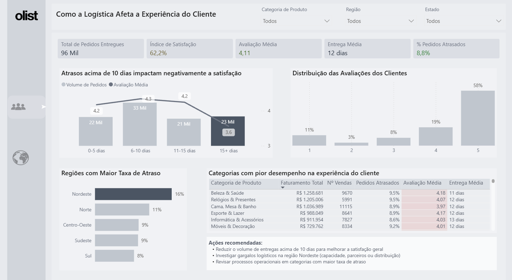
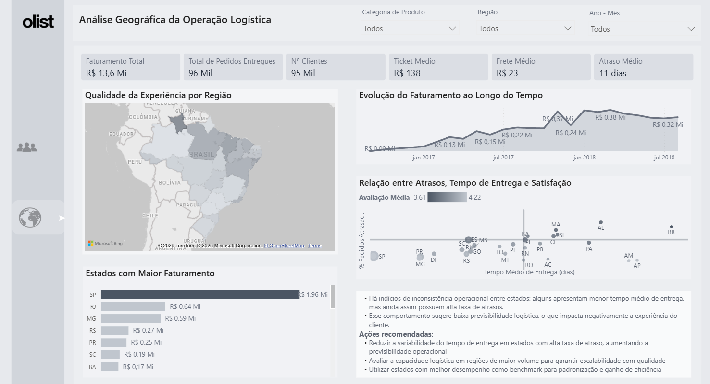

# Olist E-commerce – Experiência do Cliente e Logística

Projeto de Business Intelligence desenvolvido com base no dataset real da **Olist**, com foco em entender como a operação logística e os tempos de entrega impactam diretamente a satisfação do consumidor final.

---

## Dashboard Preview

### Impacto Logístico na Experiência


### Análise Geográfica da Operação


### Demonstração de Uso
https://github.com/debrr/PowerBI_olist/blob/main/Media/navegacao.mp4?raw=true

---

## Objetivo do Projeto

Construir um **dashboard interativo no Power BI** que correlacione métricas operacionais de logística com indicadores de satisfação (Reviews). O foco é identificar gargalos que prejudicam a experiência do usuário, permitindo uma atuação estratégica sobre a malha de entregas.

---

# Business Questions

O dashboard foi construído para responder perguntas estratégicas como:

### Experiência do Cliente (CX)
* Como o índice de satisfação varia conforme o tempo de entrega?
* Qual o impacto real na nota do cliente quando o produto atrasa mais de 10 dias?
* Quais categorias de produtos possuem o pior desempenho em experiência do cliente?

### Performance Logística
* Qual é o tempo médio de entrega geral e por região?
* Quais regiões do Brasil possuem a maior taxa de atraso?
* Como o custo do frete médio se comporta entre os estados?

### Performance de Vendas
* Qual é o faturamento total e como ele evoluiu ao longo do tempo?
* Quais estados concentram o maior volume financeiro (Faturamento)?

---

# Principais KPIs

O dashboard apresenta indicadores estratégicos de performance:

* **Total de Pedidos Entregues:** 96 Mil
* **Índice de Satisfação:** 62,2%
* **Avaliação Média:** 4,11
* **Entrega Média:** 12 dias
* **% Pedidos Atrasados:** 8,8%

---

# Visões do Dashboard

## 1. Como a Logística Afeta a Experiência do Cliente
Esta visão foca na correlação entre prazos e satisfação.
* **Análise de Atraso:** Identifica que pedidos com mais de 15 dias de atraso derrubam a nota média para 3,6.
* **Desempenho por Categoria:** Tabela detalhada cruzando Faturamento, Pedidos Atrasados e Avaliação Média.
* **Ações Recomendadas:** Insights automáticos sobre onde investir esforços para melhorar o NPS.

## 2. Análise Geográfica da Operação Logística
Focada em território e dispersão de dados.
* **Faturamento por Estado:** Ranking evidenciando São Paulo como principal mercado (R$ 1,96 Mi).
* **Relação Atraso x Satisfação:** Gráfico de dispersão cruzando tempo de entrega e % de pedidos atrasados por estado.
* **Evolução Mensal:** Gráfico de linha mostrando o crescimento do faturamento entre 2017 e 2018.

---

# Ferramentas Utilizadas

* **SQL Server**
* **Power BI**
* **Power Query (M)** para limpeza e modelagem dos dados
* **DAX** para criação de medidas de correlação e KPIs
* **Git & GitHub** para versionamento

---

# Estrutura do Projeto

```
PowerBI_olist
│
├── Dashboard
│   └── olist.pbix
│
├── Media
│   ├── Pag1.png
│   ├── Pag2.png
│   └── Navegação.mp4
│
└── README.md
```

---

# Insights e Ações Recomendadas

Com o dashboard é possível identificar padrões como:
* **Gargalos no Nordeste:** A região apresenta a maior taxa de atraso (16%), exigindo revisão de parceiros logísticos locais.
* **Ponto de Ruptura de Satisfação:** Entregas acima de 10 dias reduzem drasticamente a nota do cliente, sendo o foco principal para ações de melhoria.
* **Oportunidade em Categorias:** Categorias como "Cama, Mesa e Banho" possuem alto volume de vendas, mas notas de satisfação abaixo da média, indicando problemas na expectativa ou entrega.
